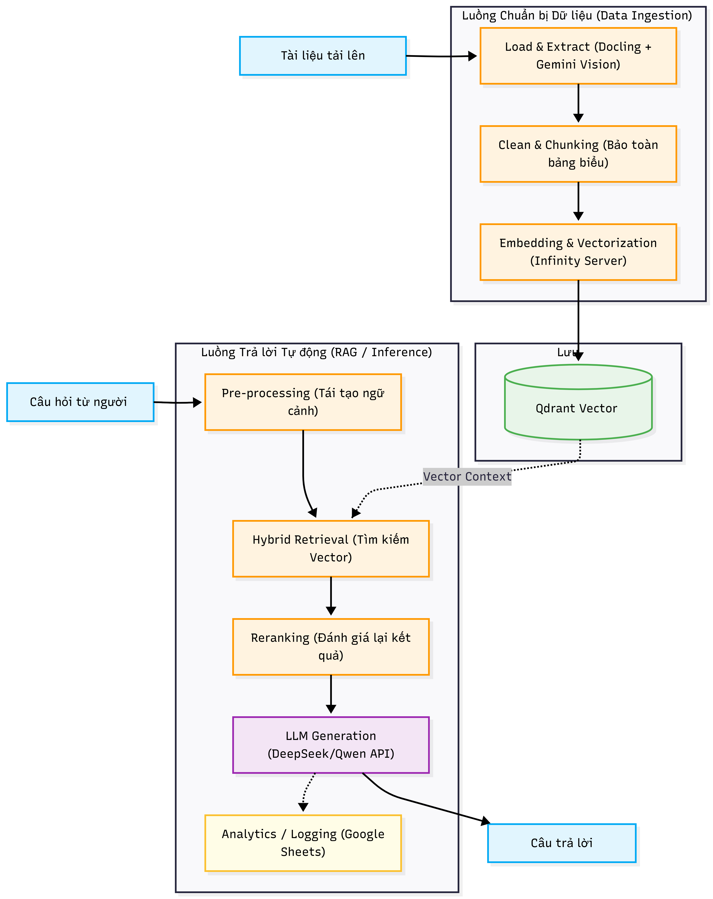
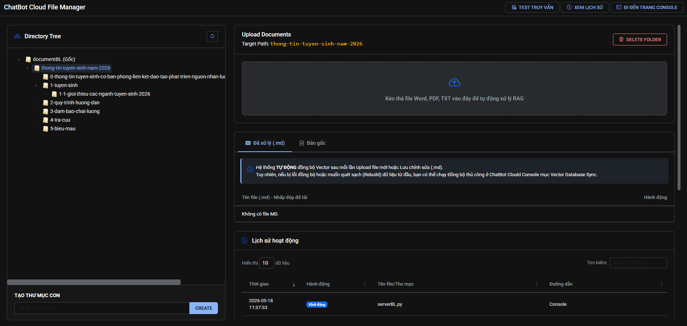
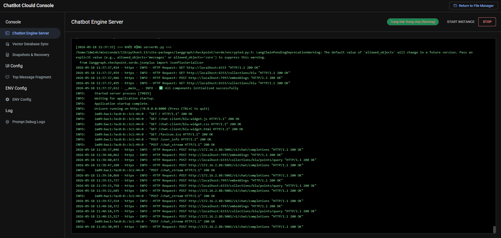

# Tài liệu Hướng dẫn và Kiến trúc Dự án Chatbot Tư vấn Tuyển sinh BLU

Tài liệu này cung cấp cái nhìn tổng quan về kiến trúc hệ thống, công nghệ sử dụng, và hướng dẫn chi tiết các bước cài đặt, vận hành hệ thống AI Chatbot Tư vấn Tuyển sinh cho Đại học Bạc Liêu (BLU).

## 1. Giới thiệu và Công nghệ

Dự án phát triển Trợ lý ảo (AI Chatbot) dựa trên kiến trúc **RAG (Retrieval-Augmented Generation)** nhằm mục đích tự động hóa việc trả lời và tư vấn các thông tin tuyển sinh, chương trình đào tạo, và thông tin chung về Trường Đại học Bạc Liêu. Hệ thống được thiết kế để xử lý tốt các câu hỏi không rõ ràng, sai lỗi chính tả của người dùng bằng cách lưu trữ lịch sử hội thoại và tái tạo ngữ cảnh thông minh trước khi trả lời.

**Công nghệ cốt lõi:**
- **Backend Framework:** FastAPI (Python) cung cấp RESTful API hiệu suất cao và quản lý tiến trình độc lập.
- **Mô hình AI (LLM):** DeepSeek (thông qua API `ds2api` / DeepSeek-v4) hoặc Qwen, tối ưu cho việc xử lý ngôn ngữ tiếng Việt.
- **Inference Server:** DeepSeek API server hoặc vLLM thay thế cho Ollama, nhằm tối đa hóa tốc độ suy luận (inference speed) và giảm độ trễ phản hồi.
- **Vector Database:** Qdrant chạy qua Docker, hỗ trợ tìm kiếm vector nhanh chóng và quản lý dữ liệu linh hoạt.
- **Embedding Server:** Phân hệ Infinity kết hợp với các mô hình `BAAI/bge-m3` và `BAAI/bge-reranker-v2-m3` phục vụ xuất sắc việc encoding cho dữ liệu tiếng Việt.
- **Framework NLP:** Langchain, KeyBERT (trích xuất từ khóa), và Docling (trích xuất văn bản nâng cao từ PDF/Word).

## 2. Kiến trúc Hệ thống

Hệ thống được chia thành hai luồng kiến trúc chính, quản lý bởi các tiến trình độc lập nhưng giao tiếp chặt chẽ:



- **Luồng Chuẩn bị Dữ liệu (Data Ingestion Pipeline - `admin-server.py` / `update_new_data.py`):**
  - **Load & Extract:** Hệ thống nhận tài liệu từ người dùng, sử dụng công cụ Docling phân tích PDF/Word phức tạp. Có tích hợp mô hình Gemini Vision để tự động phân tích và tạo chú thích cho các hình ảnh trong tài liệu.
  - **Clean & Chunking:** Dữ liệu thô được làm sạch, xóa ký tự rác và chia nhỏ (chunking) với kích thước tối ưu, đồng thời bảo toàn định dạng của các bảng biểu.
  - **Embedding & Vectorization:** Kết nối với Infinity server sử dụng Dense Model (`bge-m3`) và Sparse Model (BM25) để nhúng dữ liệu thành không gian vector.
  - **Storage:** Vector và Metadata được tự động lưu trữ (upsert) vào Qdrant Database.

- **Luồng Trả lời Tự động (Inference/RAG Pipeline - `serverBL.py`):**
  - **Pre-processing:** Tái tạo lại câu hỏi sao cho mang đầy đủ ngữ cảnh nhất dựa trên lịch sử hội thoại trước đó của người dùng.
  - **Hybrid Retrieval & Reranking:** Tìm kiếm điểm tương đồng bằng cơ chế Hybrid Search (kết hợp Dense và Sparse vector), sau đó dùng mô hình reranker để đánh giá lại và chọn ra các kết quả ngữ cảnh liên quan nhất.
  - **LLM Generation:** Xây dựng System Prompt với vai trò "Chuyên viên tư vấn", kết hợp ngữ cảnh được truy xuất và gửi truy vấn đến LLM (DeepSeek API) để sinh câu trả lời Markdown trực quan.
  - **Analytics:** Toàn bộ lịch sử session ID, câu hỏi, và thao tác được ghi log lại để giám sát (hỗ trợ xuất ra Excel/Google Sheets).

## 3. Hướng dẫn Cài đặt

Hệ thống yêu cầu môi trường máy chủ Linux/Windows đã cài đặt Python 3.10+, Docker và NVIDIA Container Toolkit (nếu dùng GPU).

### 3.1. Triển khai Qdrant Vector Database
Chạy container Qdrant để tạo môi trường lưu trữ vector cục bộ:
```bash
docker run -p 6333:6333 -v $(pwd)/qdrant_storage:/qdrant/storage qdrant/qdrant
```

### 3.2. Triển khai Infinity Embedding Server
Khởi chạy Infinity server chuyên dụng để thực thi quá trình nhúng Dense Vector và Reranking.
```bash
docker run -it --runtime=nvidia -e NVIDIA_VISIBLE_DEVICES=all \
  -v $PWD/infinity_cache:/app/.cache \
  -p 7997:7997 \
  michaelf34/infinity:latest v2 \
  --model-id BAAI/bge-m3 \
  --model-id BAAI/bge-reranker-v2-m3 \
  --port 7997
```

### 3.3. Tích hợp DeepSeek API (ds2api)
Dự án hiện tại ưu tiên chuyển sang sử dụng `ds2api` (DeepSeek) làm Inference Engine cho LLM để đảm bảo tốc độ phản hồi. Đảm bảo API Endpoint của DeepSeek (hoặc server local cung cấp dịch vụ tương tự) đã sẵn sàng hoạt động.

### 3.4. Cấu hình Môi trường (ENV)
Tạo tệp `.env` (có thể sao chép từ `example.env`) và cập nhật các thông số quan trọng:
- Thiết lập Vector DB:
  `QDRANT_URL=http://localhost:6333`
- Thiết lập Embedding Server:
  `INFINITY_API_BASE=http://localhost:7997`
- Cấu hình LLM qua ds2api:
  `LLM_MODEL_NAME=deepseek-v4-pro-nothinking`
  `LLM_API_BASE=http://<IP_DS2API>:5001/v1` (Thay `<IP_DS2API>` bằng IP thực tế của ds2api)
  `LLM_API_KEY=<API_KEY_CUA_BAN>`

Cài đặt các gói thư viện Python yêu cầu cho dự án:
```bash
pip install fastapi "uvicorn[standard]" python-multipart jinja2 slowapi pandas openpyxl python-dotenv requests qdrant-client fastembed langchain docling unstructured
```
*(Tham khảo thêm cấu hình đầy đủ từ tài liệu cũ nếu cần).*

## 4. Vận hành Hệ thống

### 4.1. Khởi động Server Admin và truy cập lần đầu
Chạy tệp quản lý hệ thống tổng:
```bash
python admin-server.py
```
Sau khi tiến trình thông báo khởi động xong, hãy mở trình duyệt và truy cập:
- **http://localhost:8081**: Giao diện Quản lý File và Dữ liệu RAG.

- **http://localhost:8081/admin/console**: Giao diện Admin Console để điều khiển tắt/mở các tiến trình con.

### 4.2. Tải lên tài liệu và chạy Update DB lần đầu
- Trên trang giao diện **http://localhost:8081**, tiến hành tải lên các file tài liệu định dạng Word chứa thông tin cần thiết vào các thư mục (dữ liệu và cây thư mục càn sạch sẽ và logic thì dữ liệu sau embedding càn chính xác).
- Admin Server sẽ tự động kích hoạt tiến trình Docling để đọc văn bản, phân mảnh (chunking), nhúng vector và đẩy tự động vào Qdrant.
- Ngoài ra, để thao tác đồng bộ thủ công cho cơ sở dữ liệu vector, bạn có thể vào tab **Vector Database Sync** trên Admin Console và nhấn **Run Pipeline**.

### 4.3. Khởi động Chatbot
Từ giao diện **Admin Console**, tại mục quản lý Service "Chatbot", nhấn nút **Start**. Hành động này sẽ khởi chạy tệp `serverBL.py` (mặc định trên cổng 8000) dưới dạng tiến trình ngầm, làm nhiệm vụ lắng nghe và phục vụ các yêu cầu chat từ người dùng cuối.

### 4.4. Cấu hình Ngrok cho Client Widget
Để nhúng chatbot vào một website khác ngoài môi trường local, bạn cần mở cổng ra mạng Internet public thông qua Ngrok:
```bash
ngrok http 8081
```

- Lấy đường dẫn public do Ngrok cung cấp (Ví dụ: `https://xyz.ngrok-free.dev`).
- Mở file nguồn của client `templates/chat-client/blu-widget.js`, tìm và thay đổi biến `API_BASE_URL` bằng đường dẫn Ngrok vừa tạo.
- Cuối cùng, nhúng đoạn thẻ `<script src="https://xyz.ngrok-free.dev/chat-client/blu-widget.js"></script>` vào trong phần `<head>` của trang web đại học cần gắn chatbot. Hệ thống giao tiếp sẽ được liên kết hoàn chỉnh.

### 4.5. Nhúng Script Chatbot Client vào Website (Cấu hình Server Local/Cụ thể)
Để nhúng chatbot trực tiếp vào một trang đích bằng IP/Domain của máy chủ:
1. Thêm thẻ script `<script src="http://172.16.2.88:8000/chat-client/blu-widget.js"></script>` vào trang đích (nhớ thay đổi URL máy chủ ở link này và cả trong source script tại `templates/chat-client/blu-widget.js`).
2. Vào **Admin Console** hoặc mở file `.env` ở server để thêm/thay đổi Trust URL cho cấu hình CORS.
3. Khởi động lại Admin Server.

## 5. Hướng dẫn Cấu hình Google Sheets Log
Hệ thống cho phép lưu lại lịch sử hội thoại lên Google Sheets, bao gồm tính năng tự động tạo Tab theo tháng và chống lỗi SSL đa luồng.

**Bước 1: Thiết lập Google Cloud & Service Account**
1. Truy cập [Google Cloud Console](https://console.cloud.google.com/).
2. Vào **APIs & Services > Library**, tìm và bật **Google Sheets API** và **Google Drive API**.
3. Tạo Service Account tại **APIs & Services > Credentials** > **Create Credentials > Service Account**.
4. Tại Service Account vừa tạo, vào tab **KEYS** > **Add Key > Create new key > JSON**.
5. Tải file `.json` về, đổi tên thành `google_credentials.json` và để vào thư mục gốc của dự án (cùng cấp với `serverBL.py`).
6. Mở file `google_credentials.json`, copy địa chỉ email tại trường `"client_email"`.
7. Truy cập Google Drive, tạo một Google Sheet mới (VD: `BLU_Chatbot_Logs`), nhấn **Share** (Chia sẻ) và cấp quyền **Editor** (Người chỉnh sửa) cho email Service Account vừa copy.
8. Copy **Spreadsheet ID** từ thanh URL (đoạn mã nằm giữa `/d/` và `/edit`).

**Bước 2: Cập nhật biến môi trường (.env)**
Thêm các cấu hình sau vào file `.env`:
```env
# GOOGLE SHEETS CONFIG
GOOGLE_SHEETS_CRED_FILE=google_credentials.json
GOOGLE_SPREADSHEET_ID=dán_spreadsheet_id_của_bạn_vào_đây
```

## 6. Quy tắc Soạn thảo Tài liệu (Word) làm Dữ liệu cho Chatbot
Để hệ thống phân tích và nhúng dữ liệu chính xác, tài liệu đầu vào cần tuân thủ các quy định sau:

- **Cấu trúc ưu tiên:** Chữ -> Bảng biểu -> Hình ảnh.
- **Không dùng icon/ký tự đặc biệt:** Tránh sử dụng icon dạng hình ảnh copy-paste vì chúng sẽ làm nhiễu thông tin trong quá trình xử lý dữ liệu.
- **Hình ảnh:**
  - Hình ảnh đưa vào cần rõ ràng.
  - Sử dụng định dạng Wrap Text là **Top and Bottom** (chữ trên và dưới) để văn bản không bị lẫn lộn với chú thích ảnh sinh tự động sau này.
  - Nên có đoạn văn bản miêu tả nội dung bức ảnh ở bên dưới để dễ dàng truy xuất.
- **Định dạng cấu trúc:**
  - Dùng **Heading** (Heading 1 đến 7) để phân cấp các đề mục, tên đoạn, tiêu đề của tài liệu. **Tuyệt đối không dùng cách bôi đậm hoặc tăng kích thước chữ thay cho Heading**, vì nó không có chức năng phân chia khi đưa vào xử lý chunking sau này.
  - Dùng **Numbering** hoặc **Bullets** để liệt kê danh sách. Có thể kết hợp cả Heading và Numbering cho các tiêu đề dạng danh sách (mục 1, mục 2, v.v.).
  - Các bảng biểu phải có cấu trúc đơn cột, đơn hàng (không gộp cột, gộp hàng, gộp ô) và phải có tiêu đề ở phía trên bảng.
  - Các bảng phức tạp hoặc quá dài cần được tách nhỏ thành nhiều bảng (mỗi bảng tốt nhất chỉ nên tối đa khoảng 15 dòng và 8 cột).
- **Nội dung:**
  - Dữ liệu phải cô đọng, chính xác và bám sát với tên file. (Ví dụ: file `học phí` chỉ chứa thông tin liên quan đến học phí, file `thông tin ngành` chỉ chứa thông tin của đúng ngành đó).
  - Không lặp lại thông tin trên nhiều file (Ví dụ: thông tin liên hệ chỉ cần 1 file duy nhất dùng chung cho các bộ phận như tuyển sinh, giáo vụ, ký túc xá).
  - Nên thêm phần **CÂU HỎI THƯỜNG GẶP** và câu trả lời tương ứng ở cuối mỗi file.
- **Quy tắc đặt tên:**
  - Tên file dữ liệu cần bao gồm năm áp dụng (VD: `học phí năm 2026.docx`).
  - Heading 1 (Tiêu đề lớn đầu tiên) cũng phải kèm theo năm áp dụng (VD: `HỌC PHÍ NĂM 2026`). Khuyến nghị tham khảo các thư mục dữ liệu chuẩn đã qua chỉnh sửa.
